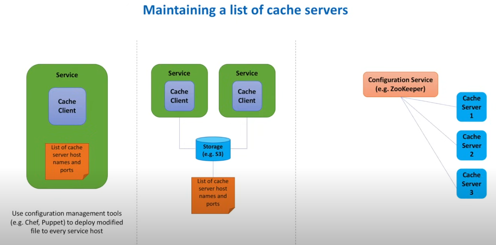

- Explain about Types of Cache

    - __Client Side__ Caching (at Web Browser - HTTP Caching)
    - __CDN caching__
    - __Load Balancer Caching__ (eg : Reverse Proxy such as Nginx)
    - __Server Caching__ (Backend Server Might have in-built cache - Every Programming Language have it)
    - __Database Caching__ (MySQL, Mongo DB have default Caching)
    - __Application caching__  (Prominent One - Application Takes care of Caching Strategy, Eviction Policies etc.. and Cache is an External Source (Redis, etc..))

    __Distributed Caching__ is often used in Modern Systems.

### Functional Requirements
- Put (Key, Val)
- Get (Key)

### NFR
- Scalable 
- Highly Available 
- High performance
- We prefer Performance, Availability over Consistency

## Design

- Local Cache with Datstructure (HashMap) - Simple Design
- To Handle Space Efficiently, Eviction Policies such as LRU, LFU Can be used. - HashMap + DLL
- This Fails at large Scale we can not coordinate between servers if Local Cache is present

### Distributed Design

- Sharding Cache Servers using Consistent Hashing 
    - Normal Caching Fails
    - Basic Consistent Hashing  - Uneven Distribution
    - Virtual Nodes + Basic Consistent Hashing - Uniform Distribution
- Cache Server Management
    - With S3, and General , we need to Manually update files and status of Cache
    - Configuration Service (Service Discovery) - Apache ZooKeeper

    
### Justifying Requirements

- Scalable - Sharding, Consistent Hashing
- Highly Available - Replication (Leader Follower and, Elect Leaders using Consensus Algorithms with help of Configuration Service)
- High performance (Fast Puts and Gets) - Algorithms

### Tradeoffs
- We can asynchronously Replicate to Increase Latency but it depends on choice
- Local Cache and Remote Cache (Distributed)
- Security (We should encrypt and Decrypt, but depends on choice as it is time consuming)
### Caching Strategies
Best Explanation : https://www.youtube.com/watch?v=2zIFUqTx_TU

#### Read Heavy
- __Cache Aside__ (Read from Cache If present else read from DB, Later Cache is updated) - Widely used (Redis, Memcached etc..)
Pros : Suitable for Read Heavy, Even Cache is Down Data is Fetched from DB, Cache Schema can be different from DB Schema
Cons: For Initial requests (always cache Miss ) - Hence We can Pre Heat the Cache, Chance of Inconsistency b/w cache and DB

- __Read Through__ (Read from Cache If present else cache updates iself from DB and return to client)
Pros : Good for Read Heavy, Cache Updation is taken care by Cache itself instead of Application
Cons: Cache Schema should be same as DB, We should Pre Heat Cache, Complexity in Cache Eviction and Overhead of Cache Management

Both Cache Around and Readthrough are same except that in Cache Around application takes care of Updating Cache, In Read-Through Strategy Cache by default updates itself.

#### Write Heavy

- __Write Through__ (Write to Cache and Write to DB -- Both happens synchronously) - Best when write operations are less
    - Should be Used with Read Through or Cache Aside 
- __Write Back__ (Write to Cache every Time (Synchronous) -- DB is updated at intervals using Cache -- Asynchronously) - Eg : Edit Message in Whatsapp
    - Best for Write Heavy
    - Widely used in Relational Databases
    - Gives better Performance when used with Read Through or Cache Aside
    - Pros : Even When DB Fails, Write works, Cahce Hit Increases a lot
    - Cons : During Updates to Values, if DB Fails and Cache has already sent for Queing then issue with Data Consistency(We can set TTL in Cache to Avoid this)
    
- __Write Around__ (Write Directly to DB and Update Cache when required) 
    - It is Implemented along with Read Through or Cache Aside 
    - It Marks whether Data in Cache is STale or not based, If not stale read from Cache
    - Resolves Inconsistency Problems Cache and DB

### Cache Eviction Policies

- __LRU__ Least recently Used
- __LFU__ Least Frequently usedd
- __MRU__ - Most recently Used
- __FIFO__ - First in Firt Out
- __RR__ Random Replacement

