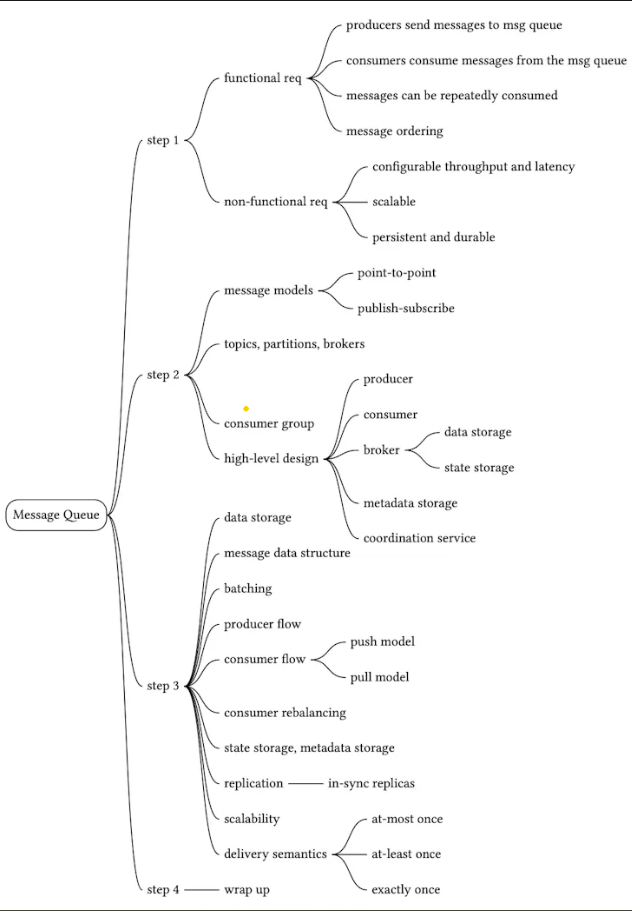
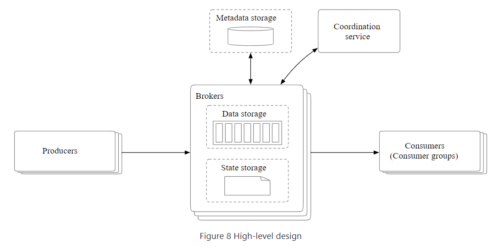
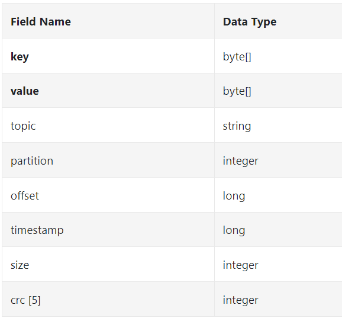
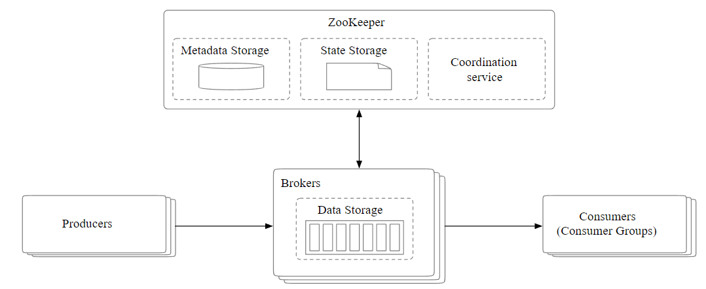

- A messaging Queue primarily has 2 Paradigms
    - P2P (SQS, etc.)
    - Pub Sub (Kafka, etc.)
Since Kafka Can support both Paradigms , Let's design Kafka

For Data Storage
1. Database (But slow writes and reads)
2. Write Ahead Log (Plain file and append messages at the end) and Storage on Disk. Since Disks are good for Sequential Access (Bad for Random), It fits our usecases.
3. A modern operating system caches disk data in main memory very aggressively, so much so that it would happily use all available free memory to cache disk data. The WAL takes advantage of the heavy OS disk caching, too,

Syn-Acks
- Ack = 0 (Producer does not wait for Broker Acknowledgment)
- Ack = 1(Producer Waits for Leader Broker Acknowledgement )
- Ack = all (Confirming acknowledgements for all In Sync Replicas)

