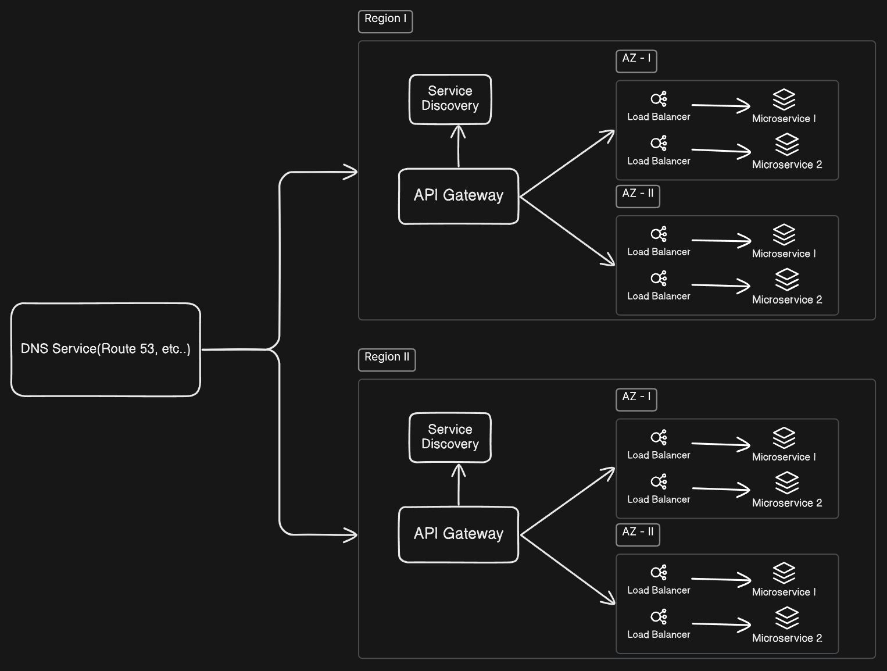

SOA Vs Microservices vs Monolith : https://www.youtube.com/watch?v=XjpxyGEUzBs&t

SOA is Services Autonomy not Runtime Autonomy

Microservices are runtime autonomy as well

https://youtu.be/EpyPFnjue38

- CDN : A content delivery network (CDN) is a geographically distributed group of servers that caches content close to end users/

## Load Balancer

- Proxy : Client Identity is Hidden
- Reverse Proxy vs API Gateway vs Load Balancer : https://www.youtube.com/watch?v=RqfaTIWc3LQ
    - Reverse Proxy : Servers identity is Hidden (acts as Intermediary between different servers) - Eg : Nginx
        - Provides Security, SSL Termination, Load Distribution and Caching. (They can not upscale/downscale)
    - Loadbalancer : Distribute Load across servers, downscale and upscale as required.
    - API Gateways are much smarter than Loadbalancers.
        - API Composition (Eg : Based on Device Type they call different Microservices and Load Data)
        - Authentication & Authorization
        - RateLimiting
        - Service Discovery (In Microservices, one will be down, new one gets created. API Can call Service Discovery or has its own which can route traffic efficiently to the target service)
        - Request - Response Transformation
        - Response Caching
NOTE : API Gateways,Loadbalancer (Typically use AUto Scaling Groups), We use API Gateway for Complex Micro Service Architecture, load Balancers in General.

## Load Balancer Deepdive

### Types of Loadbalancer

- Software (Nginx,HAProxy, etc..) and Hardware (Cisco System Catalyst, etc..) 
    - https://www.enjoyalgorithms.com/blog/load-balancers-in-system-design/

### Categories of Loadbalancer

- L4 Load Balancing 
    - Happens at Transport Layer - It makes routing decisions based on IP address and TCP/UDP port information
    - Eg : F5 BIG-IP
- L7 Load Balancing
    - Layer 7 load balancing operates at the application layer of the OSI model. It makes routing decisions based on the content of the messages, such as HTTP headers, cookies, and URL paths.
    - Eg :  Nginx, AWS Application Load Balancer (ALB)
- HA-Proxy can act as both L4 and L7 Loadbalancer.
- Global Server Load Balancing 
    - Global Server Load Balancing distributes traffic across multiple geographical locations or data centers. It provides disaster recovery and improves performance by directing users to the nearest or most optimal server.
    - Eg : Cloudflare,Akamai

### Load Balancer Algorithms

- Explanation : https://www.youtube.com/watch?v=dBmxNsS3BGE
- https://www.enjoyalgorithms.com/blog/types-of-load-balancing-algorithms/
#### Static
- Round Robin
- Sticky Round Robin
- Weighted Round Robin
- Hash Based
#### Dynamic
- Least Connection
- Least Response Time

## Data Transfer between Client and Server
- Client Pull 
- Server Push
- RealTime (Continuous Interaction) 

### Cient Pull (Short Polling, Long Polling)

- Short Polling: In a short polling client requests data from the server and the server will return the response if it is available and if it is not available then it returns an empty response. This process will be repeated at regular intervals.

- Long Polling: In long polling, the client sends a request to the server and if the response is not available then the server will hold the request till the response gets available, & after the availability of the response, the server will send the response back. After getting a response, again the request will be made either immediately or after some period of time and this process will repeat again and again. In simple words, the client will always be in the live connection to the server.
    - Eg : Train Tracking in Booking System

Overview : https://www.youtube.com/watch?v=ZBM28ZPlin8&list=PL9nWRykSBSFgkCmkYdEfmXHX71m1UybNL&index=4
- https://www.geeksforgeeks.org/what-is-long-polling-and-short-polling/
- Web Sockets : https://www.enjoyalgorithms.com/blog/web-sockets-in-system-design/

### Server Push (Server Sent Events)

SSE is Server Push Technology that establishes a long lasting connection between client and server. Server sends continous data streams and updates ,clients use Javascript API called (__EventSource__) to achieve this.
- Eg : Newsfeeds / Social Media , Updating Stock Prices, Live Sports Update

More explanation can be found here : https://www.enjoyalgorithms.com/blog/server-sent-events/

### RealTime - (Web Sockets)

Enables Bidirectional Communication between clients and server. It Provides full-duplex communication channel over a single TCP Connection and allow data transfers in both Directions.
- Web socket remains open until one of the parties close it.
- They are HTTP compatible as well.

Eg : Real Time Messaging, MultiPlayer Gaming etc..

More explanation cane be found here : https://www.enjoyalgorithms.com/blog/web-sockets-in-system-design/