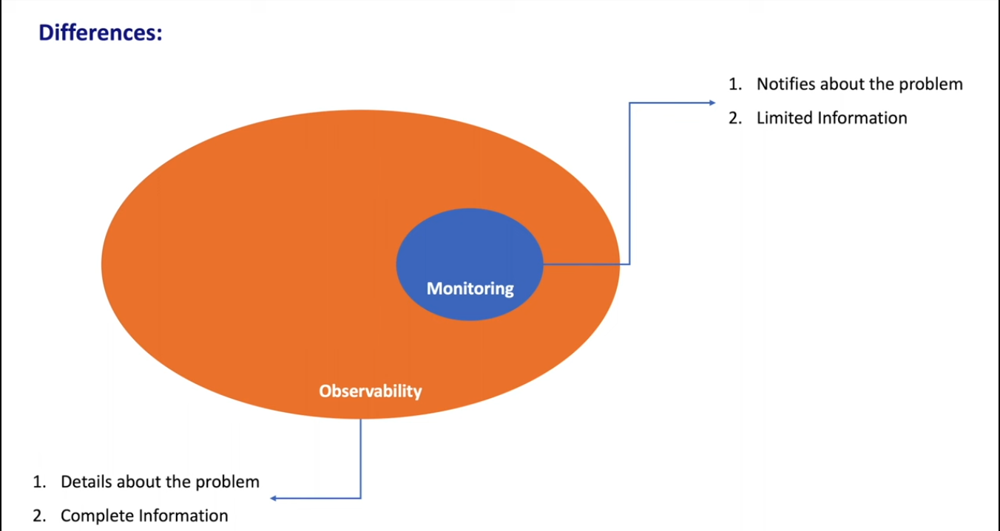

## Monitoring 

Monitoring is the process of collecting, analyzing, and using data to track the performance and health of a system over time. 
It involves predefined metrics and thresholds to detect known issues. (Eg: Latency, If it is not matching our standards, It sends alerts).

__Measure and Consolidate Key Metrics, Visualize them and Send Alerts.__

Eg : Nagios, Prometheus (Preferred for Time Series) , DataDog,  New Relic
### 4 Fundamental Metrics of Monitoring

1. Latency
2. Traffic (No.of requests system receives over a period)
3. Errors (Dashboard of Error Status codes)
4. Saturation (Measures resource Utilization - CPU, Memory and Disk)

## Observability

Provides insights into system internals for deep analysis, Root Cause Analysis and Helps in resolving the issue.

Eg : Splunk, Grafana, Open Telemetry, Dynatrace, Sumo Logic

### 3 Pillars of Observability
1. Logs (Splunk)
2. Metrics (Prometheus)
3. Traces

## Differences

__Monitoring Can Detect and Alert us, To Fully find the root cause and resolve it Observability is requird__.

| **Aspect**              | **Monitoring**                                           | **Observability**                                         |
|-------------------------|----------------------------------------------------------|-----------------------------------------------------------|
| **Approach**            | Reactive                                                 | Proactive                                                 |
| **Data Scope**          | Predefined metrics and thresholds                        | Comprehensive data collection (logs, metrics, traces)     |
| **Focus**               | Known issues and system uptime                           | Understanding system behavior and diagnosing unknown issues |
| **Complexity Handling** | Suited for simpler, predictable systems                  | Designed for complex, distributed, and dynamic systems    |
| **Goal**                | Ensure systems run within expected parameters            | Provide insights into system internals for deep analysis  |
