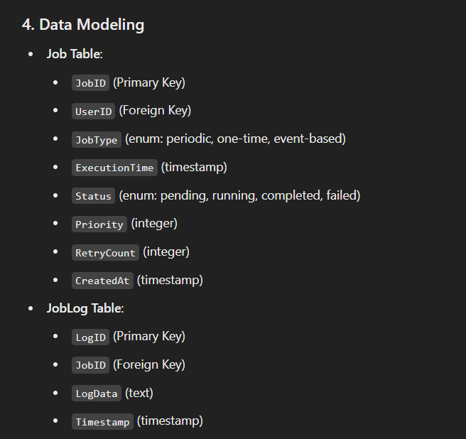
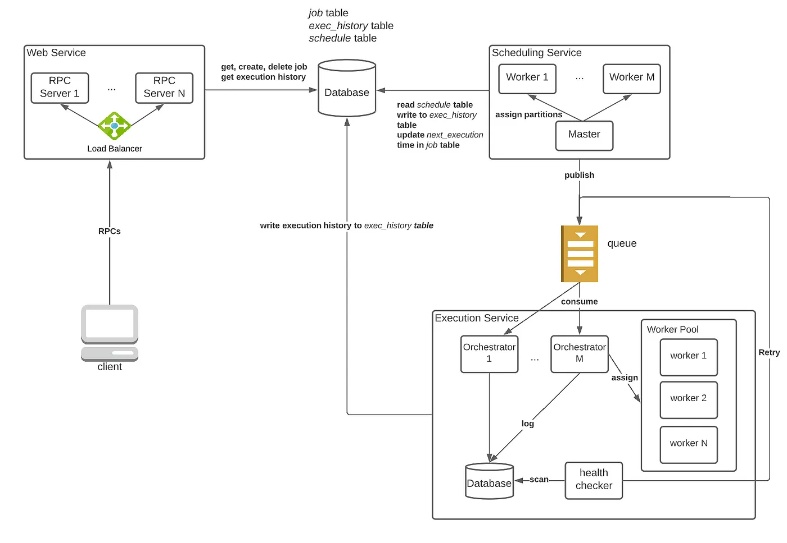

A Job Scheduler runs job automatically as per the schedule or On Demand. 
It has to handle all cases - Some requires many processors, some require only one but consumes a large time. (Few require special resources).

https://towardsdatascience.com/ace-the-system-design-interview-job-scheduling-system-b25693817950

__Job Scheduler__
- Decides When a Job has to Run
- holds jobs in Waiting Queue  (Kafka)
- Assigns Priority to Jobs (Based on Fairness, No. of current Jobs , Required resources etc..)
- Blocked Queue (Rate Limts jobs, they are eligible after a certain time) 
- Forecasts the Jobs

Other Supporting Components

__Batch Execution__
- Runs Various Jobs
- Captures Errors + Output
- Error Recovery

__Event Monitoring__
- Record Events
- Process Events

### DB Design & Data Model
__Read Operations__

Given a user ID, retrieve all jobs that belong to it (by client)
Given a job ID, retrieve all/latest execution histories belonging to it (by client)
Find all jobs that are scheduled to run right now (by internal servers) - RPC Calls

__Write Operations__
A user can create/delete a new job schedule (by client).
The workers will add execution histories to the database (by internal servers). - RPC Calls
The system updates the next execution timestamp of a job after running it (by internal servers). - RPC Calls

__Data Model__

- We need one Table for Next Time Stamp (UNIX TS be used as Normal Time is difficult to Query), Job Id
- One for Job Table
- One for Execution Log

### API Design

We use RPC Interface for Perofrming actions / all communications (Because most of them will be Service-to-service, real-time internal calls)
- submit_job(user_id, schedule, code_location)
- retrieve_all_jobs(user_id)
- delete_job(user_id, job_id)
- get_exec_history(job_id)
- get_jobs_in_next_5_mins()

 __RPC__ for Internal System
- Job Dispatching: The job scheduler makes an RPC call to a worker node to dispatch a job for execution.
 - Health Checks (Heart Beats): The scheduler periodically makes RPC calls to worker nodes to check their health status or availability.
- Status Updates: Workers report job progress or completion status to the scheduler via RPC calls.
- Job Cancellation: The scheduler sends an RPC request to a worker to stop a job if it needs to be canceled before completion.

## Architecture

- Web Service: The gateway to the scheduling system. All RPC calls from the client are handled by one of the RPC servers in this service.
- Scheduling Service: It checks the database every minute for pending jobs and pushes them to a queue for execution. Once a job is scheduled, create an entry in the execution history table with status = SCHEDULED. With this service, we guarantee that all jobs are pushed to the queue in a timely manner.
    - MapReduce, where a master is used to assign and monitor workers. If a worker dies, the master will resend its work to some other nodes
    - Uses Consistent Hashing to Shard the DB
- Execution Service: In this service, we manage a large group of execution workers. Each worker is a consumer and executes whatever jobs it gets from the queue. Additional bookkeeping is needed to ensure re-execution upon worker failures.

