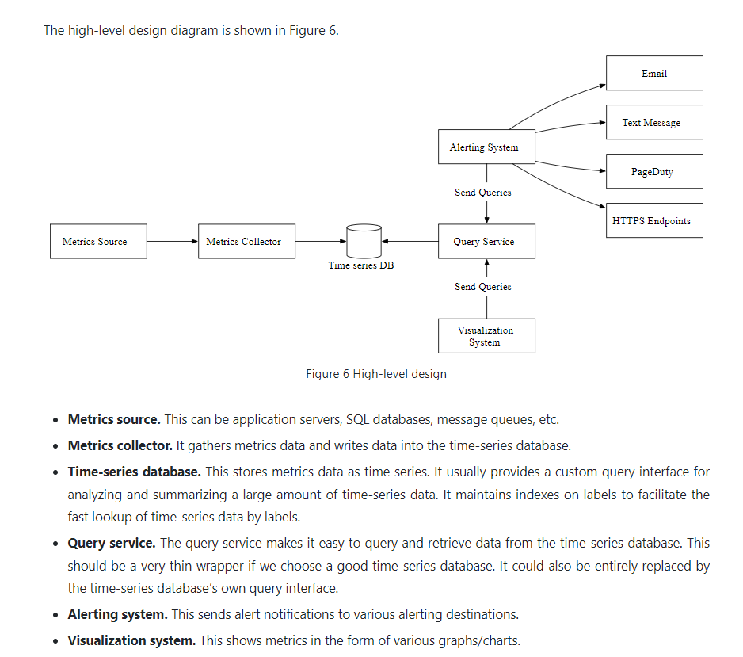

OpenTSDB is a distributed time-series database, but since it is based on Hadoop and HBase, running a Hadoop/HBase cluster adds complexity. Twitter uses MetricsDB, and Amazon offers Timestream as a time-series database. According to DB-engines  the two most popular time-series databases are __InfluxDB__ and Prometheus, which are designed to store large volumes of time-series data and quickly perform real-time analysis on that data. Both of them primarily rely on an in-memory cache and on-disk storage.

- Push Based Metrics Collector (AWS Cloud Watch)
- Pull Based Metrics Collector (Prometheus)

