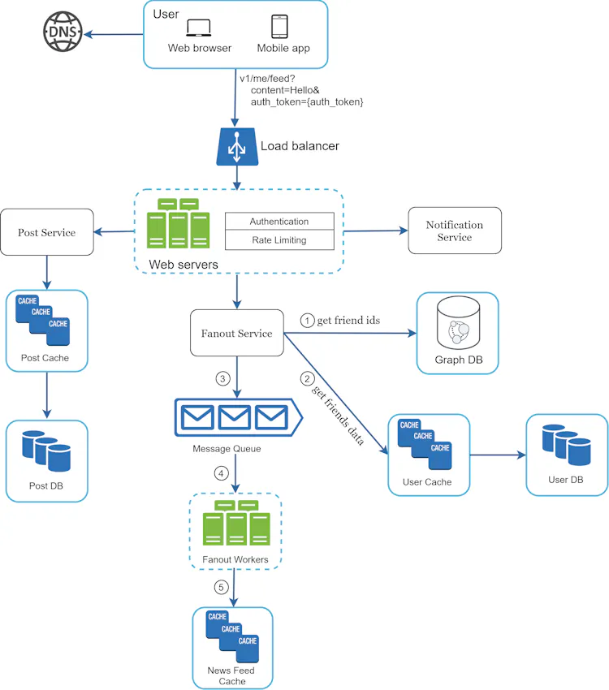
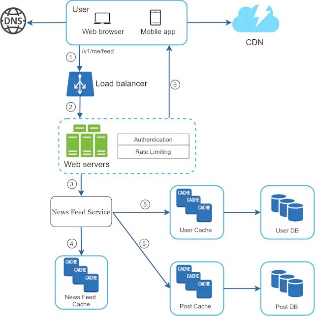

## Scope and Requirements

- Mobile and Web App
- Users Can post, View Friends posts from Feed
- All type of content can be posted.
- Users should receieve Notifications
- 10 Million DAU, Each User 5 Posts Per day
- Average Post size - 200 Bytes

#### NFR
- High availability
- Partition Tolerant
- Minimal Latency

## Data Model & API
- User Table 
- Post Table (Post Id, User Id, Content, etc)
- Friends and Followers (Graph DB)
- Feed Table (User Id , Feed ID)  and has a Feed Posts Table
    - Feed Posts Table  (Group of Posts, ) - Latest feed is shown to user

### API
 Post a new One (Feed Publishing)
- Get my Feed (Feed Retrieval)
(We Can use GraphQL for the above as well)

## HLD

System is 90% read heavy, 10% writes
1. Feed Publishing (Post API) (Fan out Write)
    - Post Service
    - Fanout Service
    - Notification Service
2. News Feed Building (Get API)
    - News Feed Service(Fanout on Read) -

Fanout on Write (For General Users) - Hot Key Problem for Celebrities, Resource wastage for Inactive users
    - We can use Consistent Hashing to Loadbalance it efficiently
Fanout on read  (For Celebrity Posts) - all above problems are resolved

### Deep Dive

1. Feed Publishing

2. Feed Retrieval

3.Explain More about Notification Service

## Enhancement of Infra & Extra Features

- CDN for Content
- Read replicas
- Consistency Models (Eventaual Consistenncy)
- Leader - Follower Replication
- SQL vs No SQL
------------------------

- Recommendation of Friends, content etc..
- Keep Web service Stateless
- Monitoring

