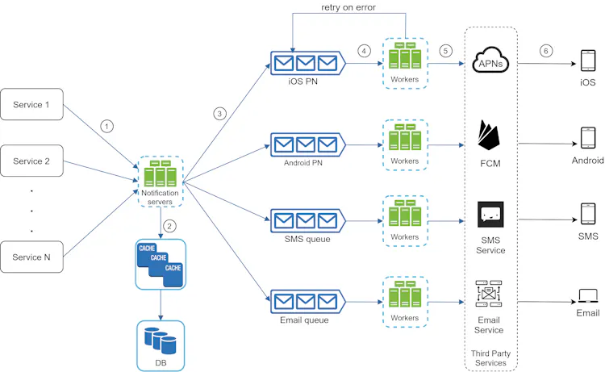
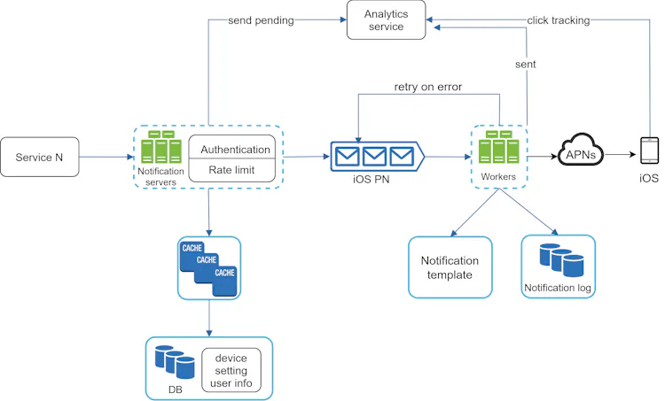

https://www.youtube.com/watch?v=OP-qawt-A3Y

## Requirements (Functional & NFR)

- Push notification, SMS message, and email.
- the supported devices : iOS devices, android devices, and laptop/desktop.
- Real Time Notifications (Delay is allowed)
- Notification Trigger (Client & Cron Jobs, Scripts)
- Unsubscribe

## Estimation
10 million mobile push notifications, 1 million SMS messages, and 5 million emails.

## API & DB

- Post send Notification
- Get Notification Status
Notification State (Start, Pending, sent, deliver, Error, Click , UnSubscribe )

- MySQL DB for 
    - USer Table
    - Device Table
    - Logs

## HLD

Services ---> Main Notiifcation Service --> Helper Services --> Devices

- SIngle Point of Failure
- Notifications LOst, No Tracking
- Not Scalable
- Overloaded Server

### DeepDive

- Retry Mechanism
- Rate Limiting
- Priority Notifications
- Notification Templates in Cache
- Analytics Service

### Enhanancements

- Deploy Geo Based Servers for Reduced Latency
- Use content delivery networks (CDNs) for faster delivery of static content.