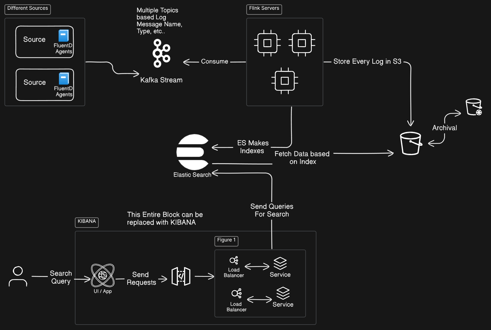

## Requirements

### Functional Requirements

- Real Time Log Ingestion
- Storage of Historical Log data
- Log Querying (Ability to do Free Text Search), Provide a powerful query interface that supports full-text search, filtering, and aggregation of logs.
- Logs are in Timestamp Order, Data Enrichment for logs
- Log Retention Policies
- Visualization

### NFR
- Low Cost SOlution for Inefficiently accessed data or Old data
- Highly Available (Ingestion and Search Services)
- Scalable (To Handle Bursty Traffic)
- High ThroughPut for Logs Ingestion and Durable
- Performance (Minimal Latency for Simple Searches)

## High Level Design

- Agents on Sources - FluentD (Lighter Weight), sends data to Kafka
- Kafka Message Queue to Stream all logs efficiently (Topics could be Log Names)
- Apache Flink (To Prcoess Events Stream and Some Extra Enrichments to it)
    - It Pushes Entire log to S3
    - May Perform Enrichments before sending it to Elastic Search
- Logs Are Stored to S3, Apache Flink pushes all logs to S3
- Elastic Search (Makes Indexes on Logs, Helps to Query Efficiently). 
    - We can Store 7 Days worth of data in Elastic Search DB and rest all in S3.

## Deep Dive

- We can add other layer of S3 Glacier (for logs older than 6 Months)
- Sharding for Elastic Search
- Elastic Search  (Stores in S3) used Indexes (Inverted) to Query.
    - It Caches a part of query rather than an Index or Full Query result.
    - It has APIs, its own Query Language
    - Managed replication & Partitioning (Either you can have seperate host for each type or Distribute it acroos and Aggregate data from Partitions when showing Search results)

- We can add Alerting Capabilities.

## Resources
- Elastic Search : https://www.youtube.com/watch?v=LqXj1oC1FH0
- Best Explanation of Logging System Design : https://www.youtube.com/watch?v=EHhKVDPZElI