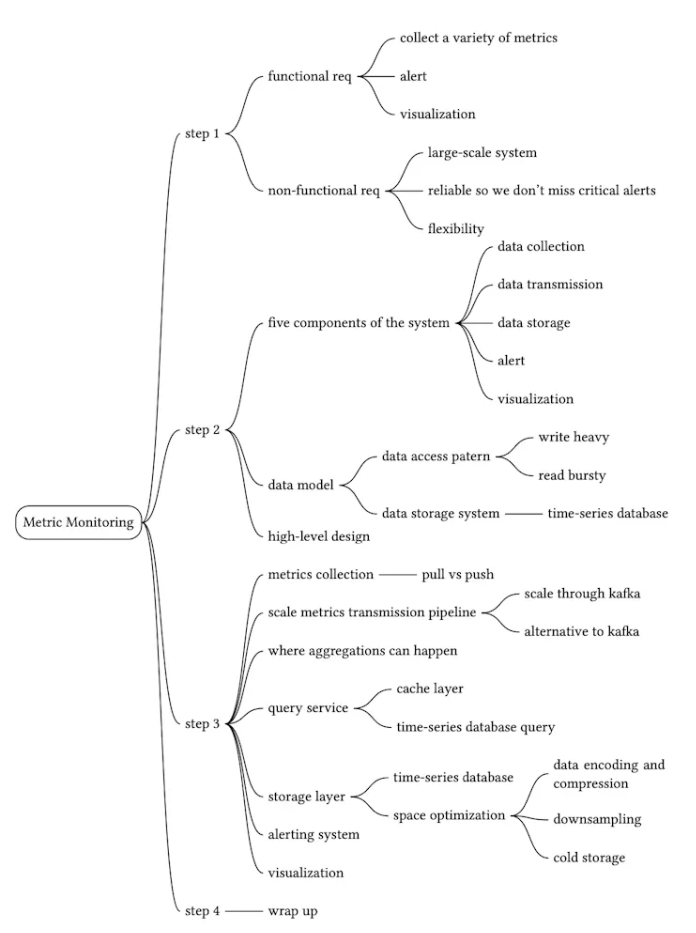
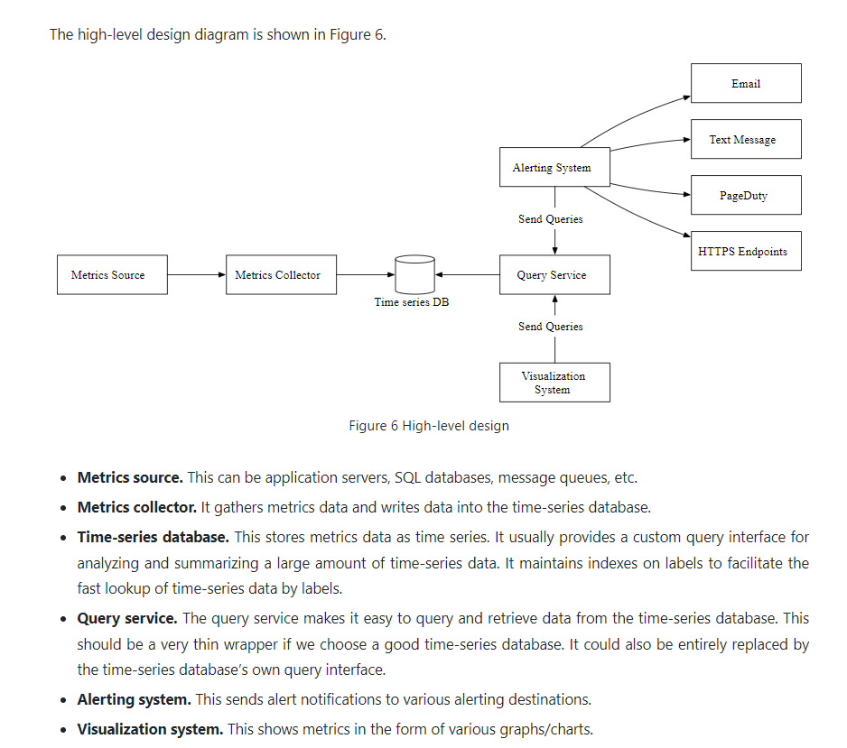
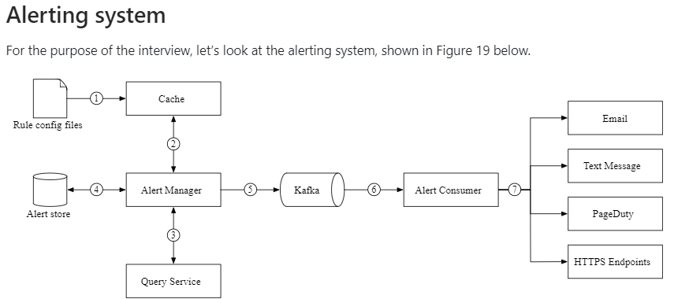
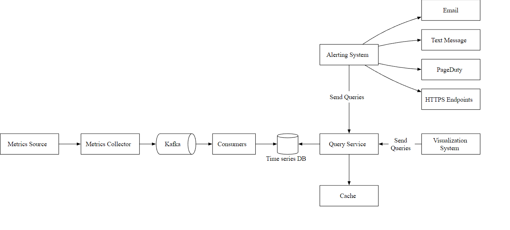

- The system is under constant heavy write load, while the read load is spiky.
- We can use SQL or NoSQL but they are Not Optimized for Time Series Querying.

- OpenTSDB is a distributed time-series database, but since it is based on Hadoop and HBase, running a Hadoop/HBase cluster adds complexity. Twitter uses MetricsDB, and Amazon offers Timestream as a time-series database. According to DB-engines  the two most popular time-series databases are __InfluxDB__ and Prometheus, which are designed to store large volumes of time-series data and quickly perform real-time analysis on that data. Both of them primarily rely on an in-memory cache and on-disk storage.

- Metrics can be collected pull or push based 
(Note : Refer ByteByte go to explain about Trade offs between Pull Based vs Push based)

- Push Based Metrics Collector (Eg : AWS Cloud Watch)
- Pull Based Metrics Collector (eg : Prometheus)
#### Space Optimization
- Data Encoding and Compression
- DownSampling
- Using Cold Storage (for > 6 Months)

- In Either Case (Push / Pull) Metrics Collector should act as Producer(Gather all data from Sources) and Push to Kafka. Then consumers or streaming processing services such as Apache Storm, Flink, and Spark, process and push data to the time-series database.

