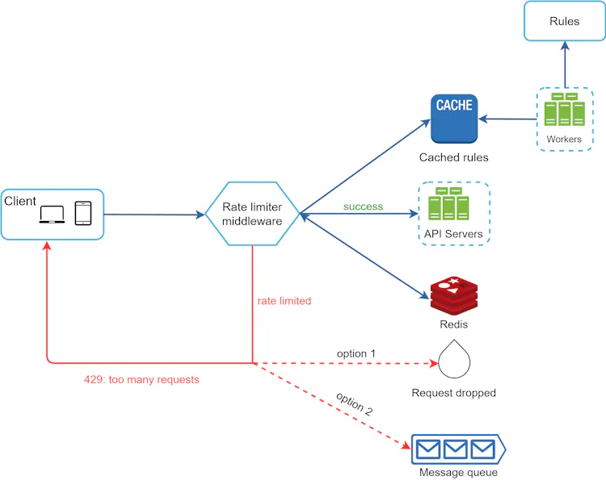

- DOS Attacks
    - Single User 
    - Single User send syn and redirecting syn acks to other
- DDOS
    - Having BotNet (Group of Affected Servers/ Computers) using them all at a time to produce heavy Traffic

Explanation : https://www.youtube.com/watch?v=gVVDo2h6DwA&t
https://www.imperva.com/learn/application-security/rate-limiting/

### Where Rate Limiter Exists

- Client Side
- Middle Ware
  - At API Gateway Level (Popular) , many api gateways have default rate Limiter, We can have our service attached to API Gateway
  - At Reverse Proxy (Nginx) or At Load Balancer level (we need to use another service that can be attached to Load Balancer)
- At Server Side (Most Preferred but complex to Code and Manage)

It is better to put at Middelware (Which can support all Architectures)
 - Microservice architecture (we can easily Integrate with API Gateway)
 - Distributed Architecture (Either at Load Balancer or reverse Proxy Level)

### Design

- We can discard rate limited requests (429 Status Code)
- We can use Queue to Store (202 - Accepted)
  Additionally we can send more info in headers in response

 
### Algorithms

- Token Bucket
- Leaky Bucket 
(Each Ip Address has its own Bucket), For instance, if a user is allowed to make 1 post per second, add 150 friends per day, and like 5 posts per second, 3 buckets are required for each user.

- Fixed Window Counter
- Sliding Window Counter
- Sliding Window Log

(Here Each Id Address / User has its own counter)