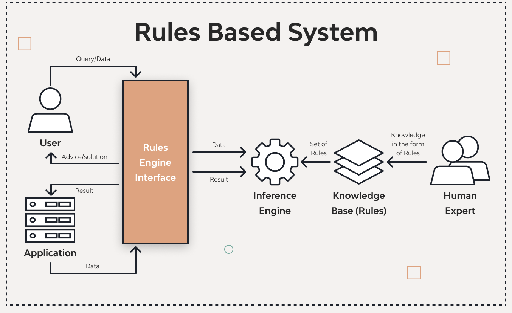
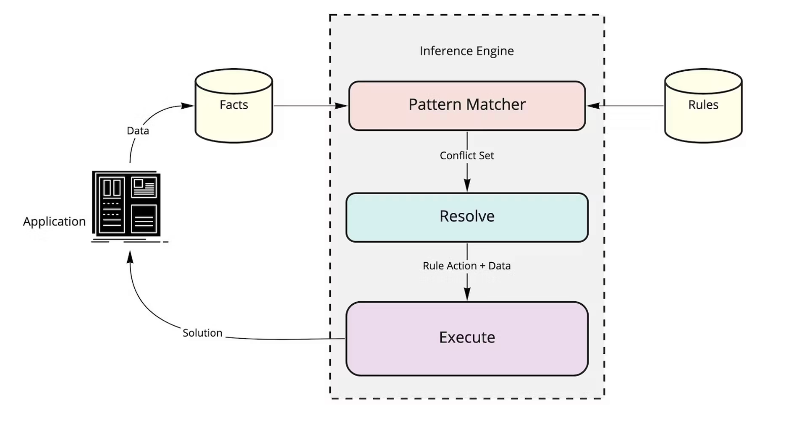
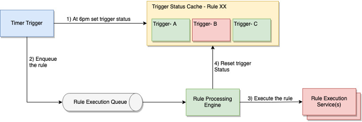
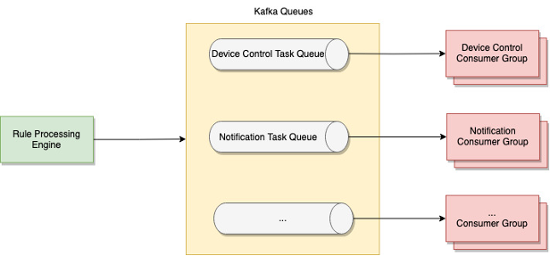

A rule engine is a system that applies business rules to input data to determine outcomes, automating decision-making. This system allows dynamic configuration of rules, making it highly adaptable to changing business requirements.

```
A person is eligible for car loan if, he has monthly salary more than 70K and his credit score is more than 900 then, approve the car loan and sanction the 60% of requested amount.
```
We can easily implement these types of rules or logic in your application. But if there are large number of logics, we need to search and apply them efficiently, below system helps to do that.

## Design Scope and Requirements

### Assumptions
- logics (rules) are frequently changing, while codebase remains same. (Hence we need to decouple)
- It should be a service and act as Independent Unit

## Functinal Requirements
- Rule Management (Ability to define, update, and delete rules.)
- Rule Evaluation
- Rule Prioritization & Grouping 
- Rule Results & Execution (Perform actions based on Final Concluded Rule)
- Versioning of Rules

## NFR
- High Availability, Partition Tolerance
- Eventual consistency is sufficient for most rule engines, particularly when integrated with asynchronous message queues.

## Simple Design



## HLD Deepdive

- Rule Repository (To Decouple the System and handle large requests) - No SQL Database
- Load Balancer (Distributes Load Across Multiple Rule Management Service)
- Rule Management Engine Service ( Inference Engine + Application Logic to perform CRUD Operations)
- Inference Engine Methods
    - Forward Chaining
    - Backward Chaining

- Queue for Single type Executions

- Kafka (for Multiple Type of Events and Services)

- Rule Executor - Most of them would be triggers (Multiple Executors - May Interact with Job Schedulers, Notification Systems etc..) 
- Monitoring and Logging

## Resources

- https://medium.com/@er.rameshkatiyar/what-is-rule-engine-86ea759ad97d
- https://www.linkedin.com/pulse/design-distributed-rule-engine-framework-neeraj-nayan/
- https://oscilar.com/blog/business-rules-engine-101