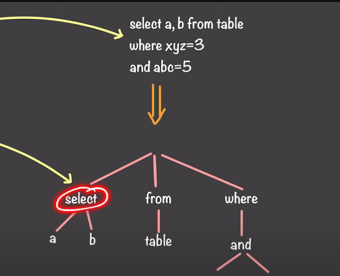

## Design SQL Engine

- How Do Databases Work : https://www.youtube.com/watch?v=FnsIJAaGRk4
- Simple Explanation : https://medium.com/cloudnloud/how-sql-engine-works-a-simple-guide-3d09edd9d99e

- Deep Dive : https://www.youtube.com/watch?v=SZdUG4CBsmo
- Deep Dive Article on SQL Engine : https://blog.devart.com/sql-server-architecture.html

- Ocean Base Database Design : https://oceanbase.medium.com/designing-a-distributed-sql-engine-challenges-decisions-52bea749b2f0

### High Level Overview

Componenets Involved
1. Parser
    - Lexical Analysis (checks it for syntactic, Breaking down Queries into Tokens - Such as Keywords, Identifiers , Literals & Symbols)
    - Semantic Checks Done by Binder
    - Parse Tree Formation
        
2. Query Optimization
    It involves analyzing the parse tree and applying various techniques to improve the performance and efficiency of the query.
    - Query Rewriting (Eg : LIKE 'A%' -> name >= 'A' AND name < 'B')
    - Query Plan Generation 
    - Query Plan Selection (Choosing the Good Enough Plan not the Best Plan) - Because Cost Based Optimizer (Selecting Best will need comparsions, which Cost Intensive).
3. Query Execution

### Deep Dive

### Life Cycle of a Query 

#### STEP I 
1. Once Parse tree is generated, it is checked whether exists in Plan Cache, if present it will execute the plan.
    (NOTE : In Parser even if Table and column does not exists It will pass because it checks syntax)
2. Binder (Consistency, Data Types Checks) - Updates Parse Tree
3. Simplification - Reducing Joins / Turing complex queries to Simple Joins (Eg: Delete Duplicates Query can be simple as Slef Inner Join)
4. Trivial Plan Generated (Simple Query, SQL Engine does not store them in the cache)

- Parser Ensures __ATOMICITY__
- Parser and Binder ensures __CONSISTENCY__

#### STEP II
(If it reached step II means it is a complex query)
1. Load Metadata (Index Statistics, Table Stats, Cardinality Estimates, etc..) - Updates Parse Tree
2. Join Heuristics ( Reorders Joins in a way that redueces the number of returned rows asap) - Updates Parse Tree.
3. Search Phases (0,1,2) : Gets Good Enough Plan
    - Search Phase 0 : Transaction Plan (Pre Optimization Stage - Step I , Simple Plans) - Small queries Max 3 Tables.
    - Search Phase 1: Quick Plan (More Transformation rules than Phase 0, Tries to find good enough plan) : - Queries for Max 8 Tables
    - Search Phase 2: Full Plan (Optimized) - All Transformation rules are unlocked, Complex Queries 

#### STORAGE ENGINE

1. Access Methods (SELECT Statements are Handled by Buffer Manager, NON SELECT  Statements are handled by Transaction Managers)
2. Transaction Manager
    - Lock Manager (for SELECT Statements, Request Buffer pool to acquire shared lock resources, for Non SELECT it should lock resources and perform actions)
        It Ensures __ISOLATION__
    - Log Manager (for all types of Queries) ensure __DURABILITY__
3. Buffer Manager (Typically in RAM)
    - Soft Parsing(Plan Exists in Cache, Data in Buffer Manager)
    - Hard Parsing (Not there in Cache, Retrieves from Data Storage (Hard Disk))

   