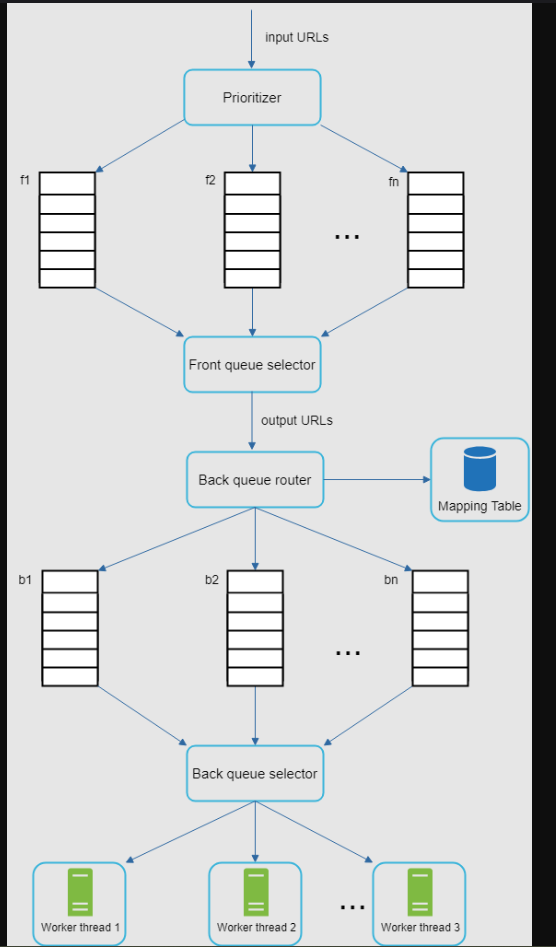

Explanation : [Tech Prep YT Channel](https://www.youtube.com/watch?v=5DTxuMDYvNc)
- Deep Dive : https://www.youtube.com/watch?v=e_aw6iJOEnY
    - Complete design : https://drive.google.com/file/d/1kTIvPhs79P8Va3WaceFKjIMhFY3v6ibF/view

Web Cralwer is used for Indexing, Data Mining, Web Archivals.

## Scope and Requirements

### Functional

- Given Seed URL, Crawl all related Pages
- Duplicate Pages are not allowed.
- What type of Content - HTML for now but need to be extensible for new content (Extensibility)
- Prioritize URLs

### NFR

- Highly Scalable
- Politeness (We should not web Page continuously) - Security
- Robustness & Reliable (Web is full of Malicious links, unresponsive servers, bad HTML responses etc..) and Our system should be able to handle it.

## Estimation

- 1Billion (10^9) writes every Month
- Average write size - 2.5MB == 2,621,440 bytes
- Storage requirement for 5 year : 1.5 * 10^17 TB (30 Peta Bytes)

## HLD

- Seed URLs --> URL Frontier --> HTML Downloader (DNs Resolver API) --> Content Parser --> Content Seen --> Link Extractor (API, BFS)--> URL Filter --> URL Seen (Bloom Filter, Hashing)
- URL Frontier (Priority Queue + Politness Queue (Robots.txt), Freshness) - It is a Server with Good disk storage

- Use S3 to Store Content, For checking Duplicate Content we can use MD5 Hashing - But Crawlers widely use SIM Hashing
- For Storing URLs we can use No SQL Key Value Store 

## Edge Cases & Security

- Spyder TRaps
- Avoid Reduadant and Spam Content
- Server Side rendering should be included in system
## Wrap up

- Discuss about Sharding, scaling, Analytics and Monitoring