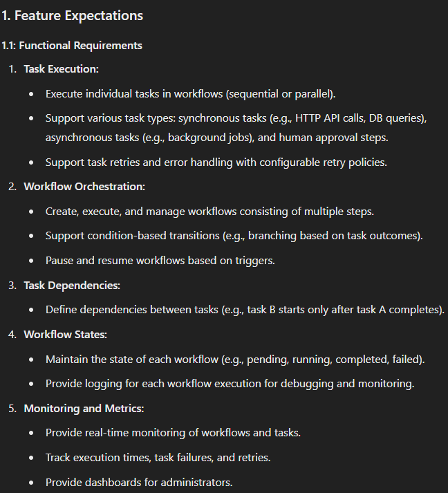
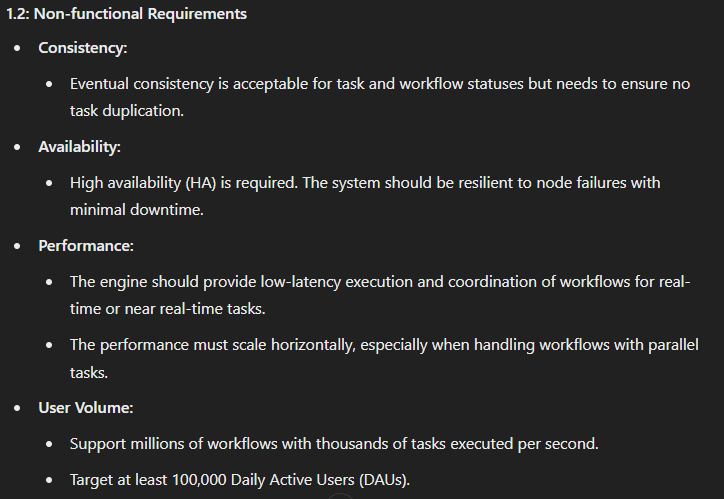
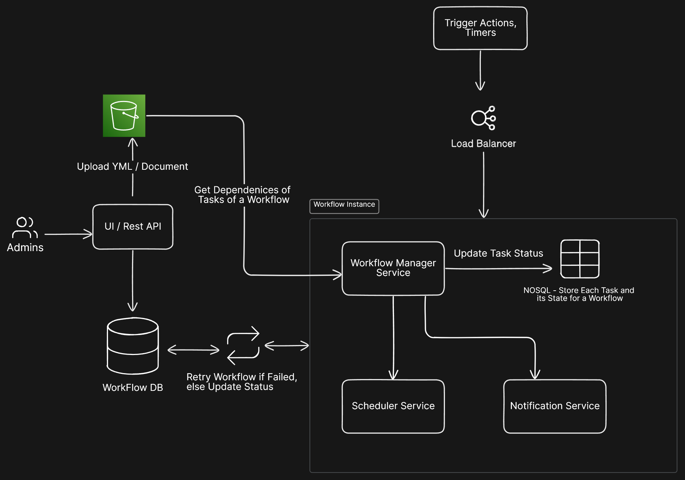
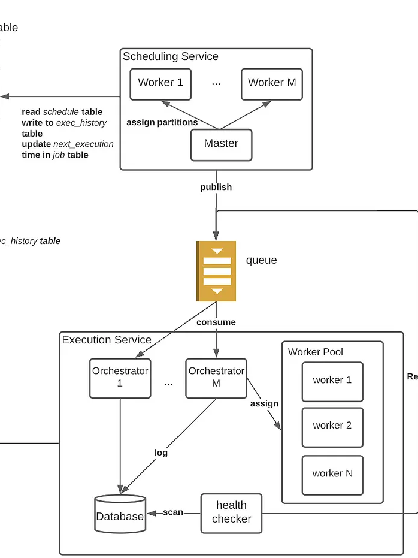
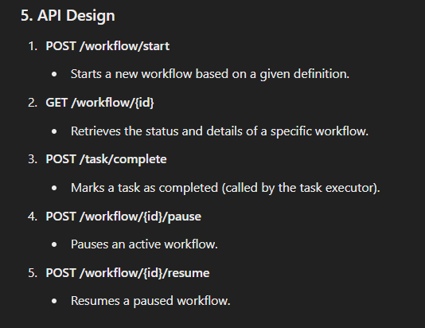

## Introduction

__Workflow Engine__ (Orchestrator as a service)

```
A Workflow Engine is a system designed to execute, manage, and monitor complex workflows involving multiple tasks and processes. Workflows may be sequential, parallel, or conditional, with dependencies among tasks. The engine must handle retries, scheduling, state management, and user intervention.
```

Eg : Orchestration Service (Apache Airflow, AWS Step Functions, Camunda)

- To prevent developers from spending so much time in orchestrating their microservices to cope with complex workflows, the workflow engines handle all complexity that comes with orchestration internally and provide you with a simple way to define and update your workflow(s).

- All Tasks in Workflow should be independent

- It is a series of repeatable activity (referred to as tasks in the future), meaning that it consists out of multiple tasks that occur in a certain sequence frequently within your organization (or system). 

- Secondly, the sequence of tasks processes a set of data, each step taking something as input and giving some output after the task is done. 
Finally, the workflow must lead to a certain goal.

Microservices run Independently, produce& consume different events. Inorder to Maintain Stateful execution, and to achieve a particular usecase all these services (with states) need to be operated in a manner to achieve the Business result.

```
Consider an Ecommerce App, You will have Order Service, Inventory Service, Checkout Service, Payment Service,etc.. Each Service  have multiple tasks and states (with User). To Complete an order, all these services have to be handled as per a flow. 

Workflow Engine is widely used in Event Driven Architecture.
```


## High Level Design


### Components
- Admin -> UI-> WorkFlow Storage(S3)
- Main DB (Meta Data , Workflow Status) - Dynamo DB 
- Load  Balanncer 
- Workflow Instance (No SQL DB - Dynamo DB)
- Task Scheduling Service (SQl DB) (Time based / Event Driven)
- Queue (Rabbit MQ - for Putting out Tasks)
- Task Excutor Service
- Monitoring and Logging Services


### Deepdive

- Admins Upload Workflow Files(Either YML/JSON files  or some Document Format). They are Stored in S3. (These contains Flow of Tasks to be executed and Relevant Data of Each Task)
- Workflow Instance is the core Component which orchestrates workflows. It utlizes Scheduling Service (Which excutes Independent Tasks), Notification Service to Return Workflow Status.
    - Manages workflow definition, task orchestration, execution, retries, and task state transitions.
    - Manages the lifecycle of each workflow, including starting, pausing, resuming, and stopping workflows. 
    - It has its owne DB (which has records for each workflow (with it Task status))

```
Workflow 1 {
T1: Completed
T2: Running
T3: Waiting for T2 
}
Workflow2{

}
```

- Scheduler Service Puts each task in Queue, Schedules tasks for execution based on dependencies and timing requirements.
Manages delayed tasks, periodic tasks, and retries.

- Executor Service (Part of Scheduler) Executes them. Workers or microservices that handle task execution.
Executors pull tasks from a task queue, perform the work, and update the engine on task completion or failure. 
It has its own DB to Retry Tasks and Update Task Status.
```
T1 - W1 - Running
T2- W1 - Paused
T1 - W2 - Running
```



### API Design

## USeful Articles & Resources

- https://xavyr-rademaker.medium.com/introduction-to-workflow-engines-b0dd6e4b6628
- https://github.com/meirwah/awesome-workflow-engines
- System Design FightClub : https://www.youtube.com/watch?v=mZl4AMIUdls
