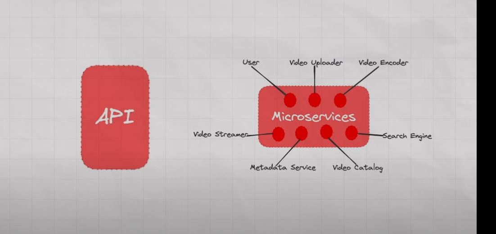
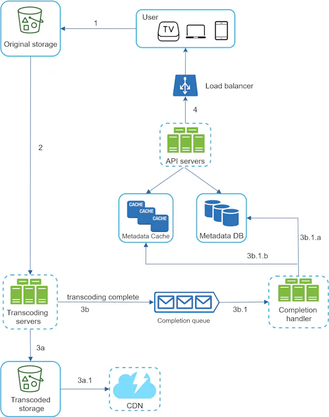
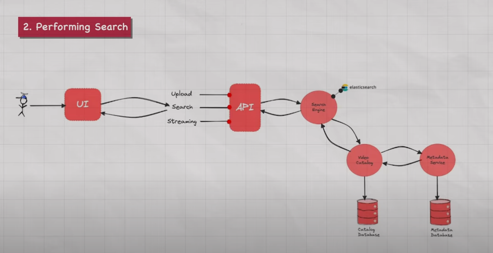
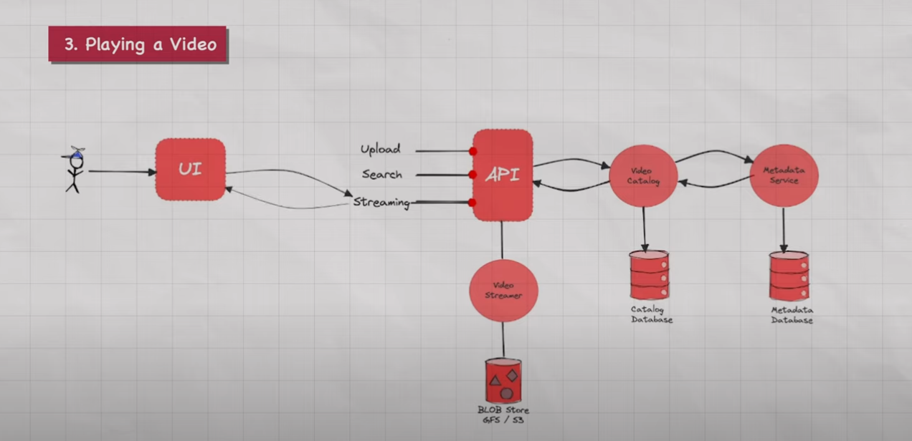

1. Upload
2. Search (Return Thumbnails)
3. Stream
Presigned URLs for Uploading Video, Streaming Vidoe

Optimization

1. Rate Limiting 
2. Compression and Decompression (Over Network)
3. Most Popular videos over CDN, rest all are on Servers

##### Resources
https://youtu.be/WlMTxHcm4Qs