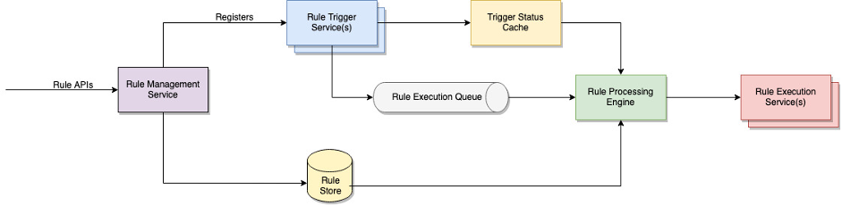
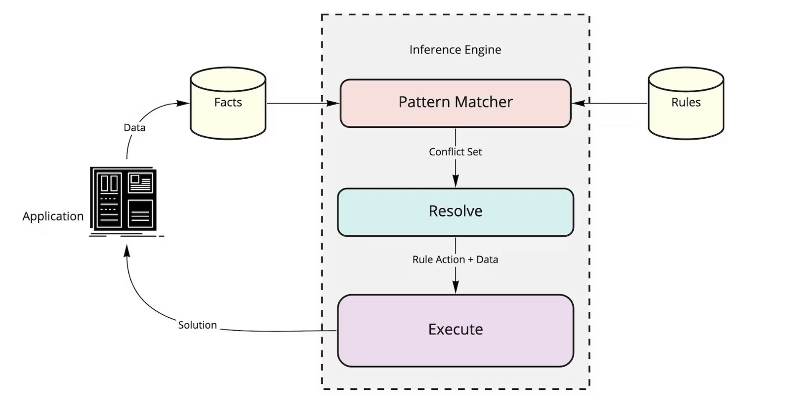

A rule engine is a system that applies business rules to input data to determine outcomes, automating decision-making. 
__This system allows dynamic configuration of rules (No Need to Hardcode the Core Codebase)__, making it highly adaptable to changing business requirements.

__UseCases__
- E Commerce Pricing Strategies
- Fraud Detection

```
When <Condition>
Then <Actions>
```
We can easily implement these types of rules or logic in your application. But if there are large number of logics, we need to search and apply them efficiently, below system Design (Rules Engine) helps to do that.

Eg : One of the Famous Rule Engine is __Drools__, below is the sample rule configured.


## Design Scope and Requirements

### Assumptions
- logics (rules) are frequently changing, while codebase remains same. (Hence we need to decouple)
- It should be a service and act as Independent Unit

## Functinal Requirements
- Rule Management (Ability to define, update, and delete rules.)
- Rule Evaluation
- Rule Prioritization & Grouping 
- Rule Results & Execution (Perform actions based on Final Concluded Rule)
- Versioning of Rules

## NFR
- High Availability, Partition Tolerance
- Eventual consistency is sufficient for most rule engines, particularly when integrated with asynchronous message queues.

## Simple Design


## HLD Deepdive



- Rule Repository (To Decouple the System and handle large requests) - No SQL Database
- Load Balancer (Distributes Load Across Multiple Rule Management Service)
- Trigger Cache
- Rule Management Engine Service ( Inference Engine + Application Logic to perform CRUD Operations)
- Inference Engine Methods
    - Forward Chaining
    - Backward Chaining
```
A rule can include one or more triggers, where each trigger establishes a specific condition that must be satisfied for the rule to execute. For example, consider a rule that turns on the living room light at six pm every day or when the ambient lighting level falls below 100 lux. The rule combines two conditions using the OR logic, the first of which is a time-based trigger and the second is the device (ALS sensor) status trigger. More complex rules can also be created with a combination of multiple triggers and logical operators. 

 To manage the status of each trigger, a persistent cache is used, which is updated by the respective trigger services. This ensures that the latest trigger status is always available to the rule processing engine, allowing it to evaluate the conditions and invoke the appropriate action. In the picture above, a red trigger status indicates that the trigger condition is currently failing, and a green status indicates that the trigger condition is already met. Once the trigger status of a rule changes, the respective trigger service adds the rule id to a queue for processing, which is subsequently consumed by the rule processing engine. 
```

- Queue for Single type Executions

- Kafka (for Multiple Type of Events and Services)

- Rule Executor - Most of them would be triggers (Multiple Executors - May Interact with Job Schedulers, Notification Systems etc..) 
- Monitoring and Logging

### Libraries

## Resources

- https://medium.com/@er.rameshkatiyar/what-is-rule-engine-86ea759ad97d
- https://www.linkedin.com/pulse/design-distributed-rule-engine-framework-neeraj-nayan/ (Best Explanation for HLD)
- https://oscilar.com/blog/business-rules-engine-101
- Drools rules Coniguration & Demo : https://www.youtube.com/watch?v=UuZ7pZ_1JDE
- Python Rule Engine : https://djangostars.com/blog/python-rule-engine/
- Drools Tutorial : https://www.guru99.com/drools-tutorial.html