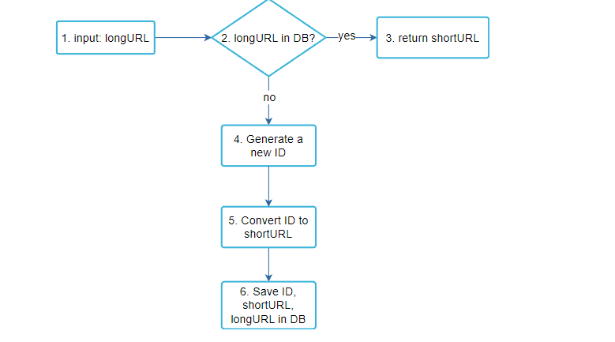
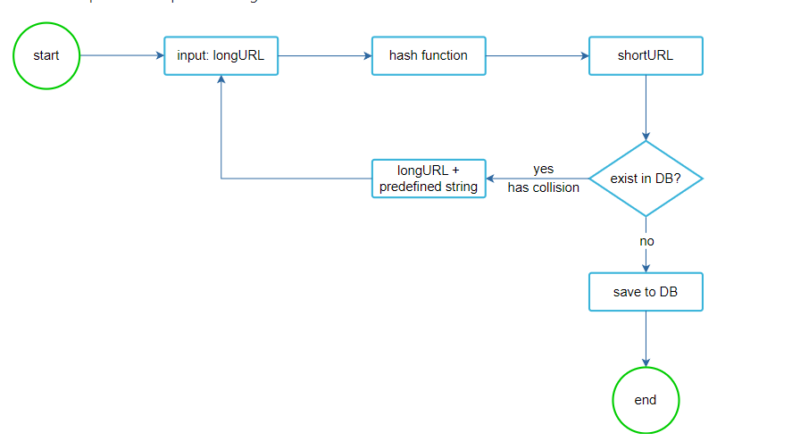

Clear Explanation : https://www.youtube.com/watch?v=16d35un5a9Q

### Scope and Requirements

- Shortened Url (should be as short as possible)
- Contains Alpha Numeric characters(62)

Estimation

- 100 Million URLs generated per day
- Average Length is 100 Chars
- For 10 Years - 36.5 TB

(Fast reads and Writes) 

### API Design

- POST URL Shortening : return short URL (201 Created, 400 Bad Request, 409 Conflict - Already Exists)
- Short URL to Long Url redirecting (GET) : If we need analytics then 302
    - 301 (Permanently Mooved) Browser Caches
    - 302  (Temporarily Moved) -  subsequent requests for the same URL will still be sent to the URL shortening service
    - 404 Not Found

### DB Design

__NOSQL__ (CASSANDRA)

- Same Short Url for all Users
Table I : Long Url (PK), Unqiue ID, Short Url, Creation TimeStamp
Table II : Short Url (PK), Unique ID, Long Url, Creation TimeStamp

If we have requirement where different users need a new Short Url for Same Long Url, then we need to Store Unique Id as Primary Key
Table I: Unqiue ID (PK), Short Url, Long Url, Creation Time Stamp
Table II : User ID, Short Url, Long Url

#### Algorithm for Same Short Url for all Users

#### Algorithm for Different Short Url for Same Long Url (Multiple Users)

Encode
- Generate Unique ID
- Perform Base 62 Encoding and Store

Decode

- Decode Unique Id by applying base62 Decoding on ShortUrl
- Return Long Url

### Java Implementation
- Here we stored in HashMap, But in real life we store in No SQL DB (Cassandra). Cassandra is Column Family Database (Ideal for Semi Structured data with related Groups).  

Note (Knowledge Base): Cassandra, HBase ( In each Object, It can have Multiple columns or 1 Column It does not matter unlike SQL)
- Cassandra distributes  data across Partitions and Queries efficiently.

### HLD

Sever, LoadBalance , Cache , DB 

### HLD Deepdive

1. With Hashing Workflow (MD5, CRC32 etc.. we extract only first 7 Characters, if exists we rehash)

2. With Base 62 Workflow + Unique ID (Snow Flake)

### Security Considerations

- Validate URLs before Sending (To Prevent from SQL Injection, other attacks)
- Rate Limiter can be Implemented
- Enhanced Monitoring and logging
